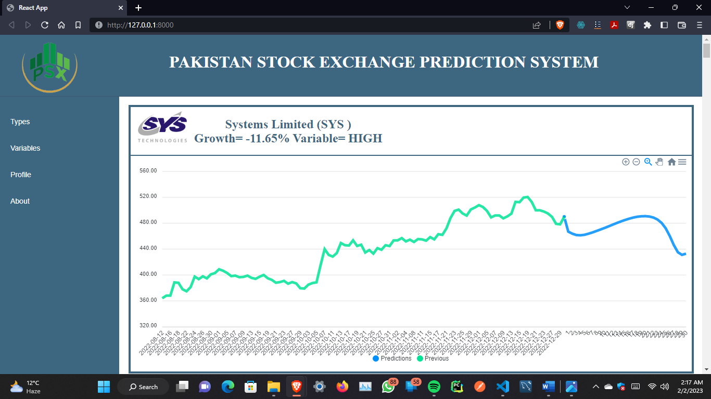

# Pakistan Stock Exchange Prediction Project
## Introduction
This project is a web-based platform for predicting the stock market. The aim of the project is to provide users with valuable insights into the stock market, enabling them to make informed investment decisions. The platform is built using the latest technologies and tools, including AI, Deep learning neural newtworks and machine learning algorithms, to provide real-time data and accurate predictions of selected 30 companies.

The platform features a user-friendly interface that allows users to track their favorite stocks and access detailed stock reports. The platform's AI algorithms analyze historical stock data and market trends to predict the future performance of stocks and provide recommendations on which stocks to buy or sell.
## Features
* Real-time stock data and insights
* Predictive analytics powered by AI algorithms
* User-friendly interface
* Shows monthly growth
* Historical stock data analysis 
* Future Predictions
* Prediction types (Short-term Long-term)
* Choice of variables (HIGH,LOW,OPEN,CLOSE)
## Technologies Used
* Python
* Django
* JavaScript
* React.js
* HTML
* CSS
* AI/ML Algorithms
## Getting Started
These instructions will get you a copy of the project up and running on your local machine for development and testing purposes.
1. Clone the repository to your local machine.
2. Navigate to the root directory of the project.
3. Install the required packages using 
`pip install -r requirements.txt`
4. Start the development server using 
`python manage.py runservers`
5. Open your web browser and navigate to
`http://127.0.0.1:8000/`
## Contributing
This project is open-source, and contributions are welcome. If you want to contribute to the project, please follow these steps:
1. Fork the repository.
2. Create a new branch.
3. Make your changes.
4. Submit a pull request.
## Attachments
The attachments section of this repository contains the necessary codes for downloading new data, creating updated datasets, data cleaning, feature extraction, training models, and more. The codes are written in Python and utilizes various libraries such as Pandas, Numpy, and Sklearn.

Additionally, the repository also includes a final report and presentation that provides an overview of the project, methodology, results, and conclusion. This information can be useful for anyone who wants to use this project as a reference for their own research or as a final year project.

To access the attachments, simply navigate to the "attachments" directory within the repository. All the necessary files and codes can be found in this directory.
## Project description
As a recent computer science graduate, I am thrilled to have worked on a stock market prediction project during my studies. This project involved creating an AI-based website that predicts the future performance of thirty selected companies in the Pakistan Stock Market. The project presented a unique challenge of dealing with large amounts of financial data and implementing effective machine learning models to make accurate predictions. I rose to the challenge by developing a custom dataset that was updated regularly and utilizing Long Short-Term Memory (LSTM) neural networks to train the models.
The website provides two prediction modules for short-term and long-term predictions and allows users to explore historical data and future predictions. The monthly growth of each company was displayed on the website, and the predictions were made for all four variables: high, low, open, and close. The user-friendly interface made it possible for the website to provide valuable insights into the stock market trends.
I had the opportunity to develop my skills in multiple areas, including data analysis, programming languages, and AI technologies. The use of Django and React frameworks helped to build a robust and scalable web application that was able to handle large amounts of data and provide seamless navigation. This project was a great learning experience, and I am proud of the work I have done. I am confident that the skills I developed during this project will serve me well in future software development projects.
## Interface

